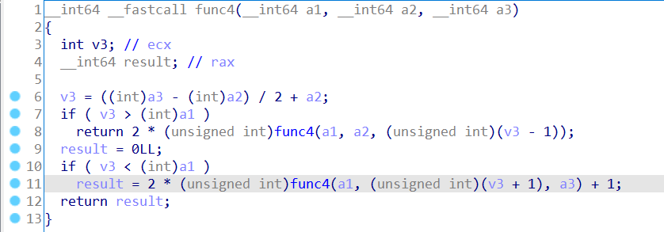
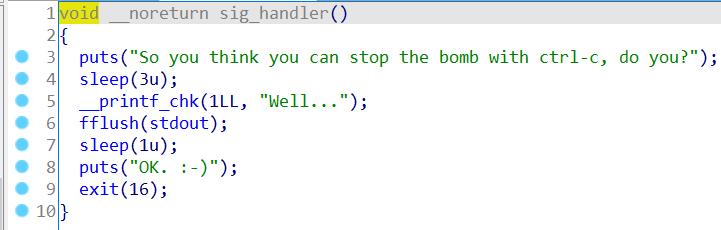

# BombLab-Solution

## Phase 1

根据函数名可知是字符串比较，直接输入字符串即可

## Phase 2

读取6个数字，要求输入是上一个数字的2倍，v3[0]=1,构造输入1 2 4 8 16 32即可

## Phase 3

switch结构，输入两个数，v2输入0-7，v3输入对应的switch结果

## Phase 4

输入的v3一定是0，v2作为func4的参数，应该返回0

func4是一个二分查找过程，输入0即可

## Phase 5

输入一个长度为6的字符串,对每个字符ASCII & 0xF 经过一个字符列表"maduiersnfotvbyl"转换最后得到flyers，

其中一个的结果为ionefg

## Phase 6

输入数据范围[1-6]，输入的数均不相同，将每个数被7减，

将数字转换为node节点首地址存放在局部变量中

在node1处按照之前存放的节点顺序构造单链表

构造出的单链表结构如下

按照单链表顺序访问，要求数值从大到小

结果为 4 3 2 1 6 5

## Phase Ex

每次经过一个phase都会触发phase_defused函数，判断输入的字符串数量为6个之后（Phase6通过），判断地址603870的输入内容（通过调试可知是Phase4的输入），

可知是第3个参数输入"DrEvil"即可进入

fun7是一个类似二叉树查找过程，将二叉树还原

得到结果

0x14 ,0x16均为正确答案，即20,22

## Egg

程序捕捉信号SIGINT(Ctrl+C可以发出)，不会引爆bomb :-)

